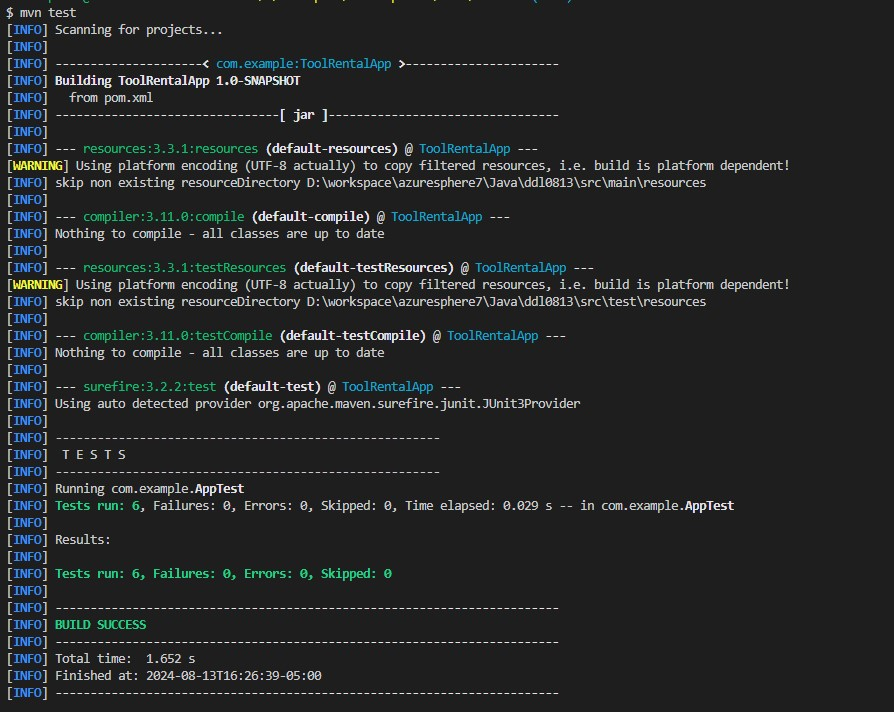

# Tool Rental Application

A Java-based tool rental application that simulates a point-of-sale system for renting out tools. This codebase calculates rental charges based on the type of tool, rental duration, applicable discounts, and specific rules around weekends and holidays. A `Rental Agreement` is generated, providing a breakdown of the charges.

## Installation

1. Make sure you have `Java` and `Maven` installed on your local environment.

2. **Clone the Repository:**
   ```sh
   git clone https://github.com/azuresphere7/ddl0813.git
   cd ddl0813
   ```
3. **Build the Project:**
   ```sh
   mvn clean install
   ```

## Usage

Run the `App` class to simulate a rental transaction. The main method provides a sample scenario:

```java
RentalAgreement rentalAgreement = new RentalAgreement(ToolType.JACKHAMMER, 9, LocalDate.of(2015, 7, 2), 0);
rentalAgreement.printRentalAgreement();
```

Run the project to see the result:

```sh
mvn exec:java
```


## Tests

**JUnit** tests contains:

- Discount validation.
- Accurate charge calculations considering weekends and holidays.
- Different tool types and rental periods.

Run the tests using Maven:

```sh
mvn test
```



## Code Structure

- **`controllers/RentalAgreement.java`**: Core logic for generating rental agreements and calculating charges.
- **`controllers/Tool.java`**: Represents a tool with its attributes.
- **`controllers/Charge.java`**: Handles the daily charges and applicable days.
- **`utils/Utils.java`**: Utility functions to set up tool data and retrieve tool details.
- **`App.java`**: Entry point of the application.

## Holidays Considered

- **Independence Day (July 4th)**: Adjusted to the nearest weekday if it falls on a weekend.
- **Labor Day**: First Monday in September.
